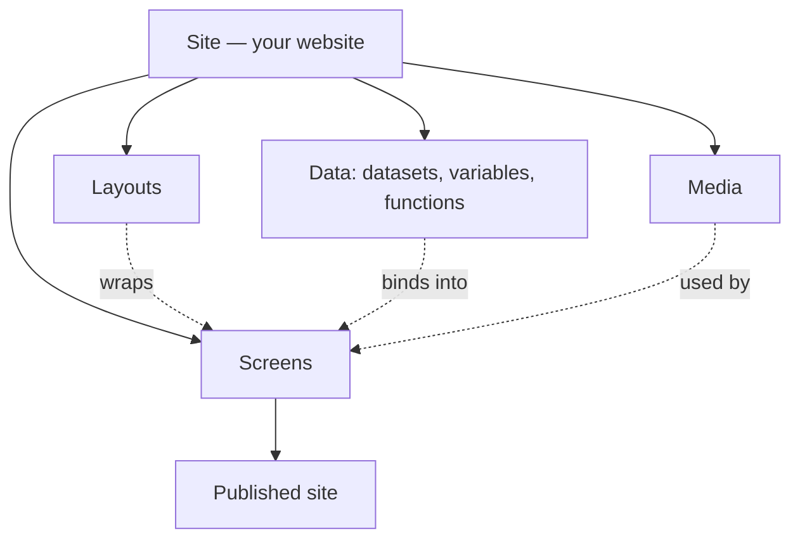

# Aglyn Documentation

  

    Aglyn is a no-code platform for building and running websites. Design pages
    visually in the Besigner, bind them to your own data, and publish to a fast,
    SEO-ready site — all without writing code. These docs teach you how to use
    Aglyn feature by feature.
  

## Start here

  <a className="home-card" href="/getting-started/create-a-site">
    
Create a site

    
Sign in, spin up your first site, and understand what a site contains.

  </a>
  <a className="home-card" href="/building-sites/besigner/overview">
    
The Besigner

    
Aglyn's visual editor — canvas, hierarchy, inline text, and styling.

  </a>
  <a className="home-card" href="/whats-new">
    
What's New

    
The features Aglyn shipped most recently, grouped by area.

  </a>

## Explore the docs

  <a className="home-card" href="/building-sites">
    
Building sites

    
The Besigner, screens and layouts, theming, bindings, SEO, protection, redirects, and domains.

  </a>
  <a className="home-card" href="/content-and-data">
    
Content &amp; data

    
Datasets and dynamic content, the media library, forms, and the contacts CRM.

  </a>
  <a className="home-card" href="/marketing-and-automation">
    
Marketing &amp; automation

    
Workflows and actions, email campaigns, overlays and experiments, AI assist, and analytics.

  </a>
  <a className="home-card" href="/commerce-and-bookings">
    
Commerce &amp; bookings

    
Product catalog, storefront, orders, POS and reservations, and scheduling.

  </a>
  <a className="home-card" href="/workspace-and-billing">
    
Workspace &amp; billing

    
Teams and roles, members-only areas, plans and entitlements, and billing.

  </a>
  <a className="home-card" href="/developers/plugins/overview">
    
Developers

    
Build and publish plugins that extend the platform, and the plugin APIs.

  </a>

## The mental model

A few concepts show up everywhere in Aglyn. Learn these first and the rest of the
product clicks into place.

| Concept | What it is |
| --- | --- |
| **Site** | Your website — its screens, theme, data, domain, and settings. You can own more than one. |
| **Screen** | A page. Screens have a URL slug, live in a hierarchy, and are edited in the Besigner. |
| **Layout** | A shared frame (header/footer/nav) that many screens render inside via a layout **slot**. |
| **Besigner** | The visual editor. Drag components onto a canvas, arrange a hierarchy, and edit text inline. |
| **Component** | A building block on the canvas (Button, Image, Video, Form, and more). Can be made **reusable**. |
| **Binding** | A live reference in a text prop — `{'{{variable}}'}`, `{'{{fn:name(args)}}'}`, or a dataset field — resolved at render time. |
| **Dataset** | Structured content (a typed model with records) that screens read from and forms write to. |
| **Plan & entitlements** | Your subscription tier gates features and quotas (Free, Pro, Business). |

:::info Plan availability
**Free** for core building. **Pro** and **Business** unlock advanced features — each page
notes what it needs.
:::

Ready? Head to **[Create your first site](getting-started/create-a-site.md)**.
